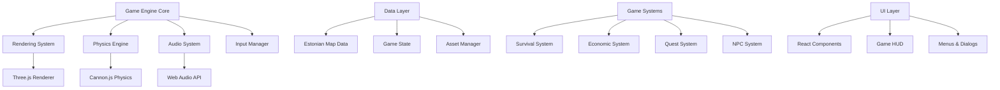

# Design Document

## Overview

The Viimsi Parish 3D Game is a web-based open-world survival/adventure game built using Three.js as the primary 3D rendering engine. The architecture follows a modular design pattern with clear separation between the rendering engine, game logic, data management, and user interface components. The system integrates real Estonian geographical data with fantasy gameplay elements while maintaining high performance in web browsers.

## Architecture

### High-Level Architecture



### Technology Stack

**Core Technologies:**
- **Rendering Engine**: Three.js (latest version) for 3D graphics
- **Physics Engine**: Cannon.js for realistic physics simulation
- **UI Framework**: React.js for component-based interface
- **Styling**: Tailwind CSS for responsive design
- **Audio**: Web Audio API with 3D spatial audio support
- **Performance**: Web Workers for heavy computations

**Data Integration:**
- **Map Data**: Estonian Land Board (Maa-amet) WMS services for Viimsi Parish area
- **Elevation**: Estonian DEM data from geoportaal.maaamet.ee (Viimsi Parish bounds)
- **Geographic**: OpenStreetMap via Overpass API (Viimsi Parish region)
- **Buildings**: Estonian Address Data System (EHAK) for Viimsi Parish

## Components and Interfaces

### Core Game Engine

```typescript
interface GameEngine {
  renderer: THREE.WebGLRenderer;
  scene: THREE.Scene;
  camera: THREE.PerspectiveCamera;
  physics: CANNON.World;
  audio: AudioManager;
  input: InputManager;
  
  initialize(): Promise<void>;
  update(deltaTime: number): void;
  render(): void;
  dispose(): void;
}
```

### Estonian Map Integration System

```typescript
interface EstonianMapLoader {
  maaametWMS: string;
  osmOverpass: string;
  
  loadViimsiData(): Promise<MapData>;
  fetchElevationData(): Promise<Float32Array>;
  fetchBuildingData(): Promise<BuildingData[]>;
  fetchRoadData(): Promise<RoadNetwork>;
  fetchForestData(): Promise<ForestBoundaries>;
}

interface MapData {
  elevation: Float32Array;
  buildings: BuildingData[];
  roads: RoadNetwork;
  forests: ForestBoundaries;
  landmarks: LandmarkData[];
}
```

### Terrain Generation System

The terrain system generates realistic Estonian landscape using heightmaps and procedural techniques:

```typescript
interface TerrainSystem {
  generateTerrain(elevationData: Float32Array): THREE.Mesh;
  createCoastline(shorelineData: CoastlineData): THREE.Mesh;
  generateForests(forestData: ForestBoundaries): THREE.InstancedMesh[];
  createWetlands(wetlandData: WetlandData): THREE.Mesh;
}
```

**Terrain Generation Process:**
1. Load DEM data for Viimsi Parish boundaries for accurate elevation
2. Generate base terrain mesh using displacement mapping within parish bounds
3. Apply realistic textures based on Viimsi Parish land use data
4. Add procedural details like rocks, vegetation specific to the parish
5. Implement LOD system for performance optimization within the defined area

### Movement and Controls System

```typescript
interface PlayerController {
  position: THREE.Vector3;
  rotation: THREE.Euler;
  velocity: THREE.Vector3;
  
  handleKeyboard(keys: KeyboardState): void;
  handleMouse(mouseMovement: MouseState): void;
  updateMovement(deltaTime: number): void;
  checkCollisions(): void;
}

interface InputManager {
  keyboardState: KeyboardState;
  mouseState: MouseState;
  
  bindControls(): void;
  getMovementVector(): THREE.Vector3;
  isActionPressed(action: string): boolean;
}
```

### Survival System

```typescript
interface SurvivalSystem {
  weather: WeatherSystem;
  dayNight: DayNightCycle;
  playerNeeds: PlayerNeeds;
  
  updateWeather(deltaTime: number): void;
  updateTimeOfDay(deltaTime: number): void;
  updatePlayerNeeds(deltaTime: number): void;
}

interface WeatherSystem {
  currentWeather: WeatherType;
  temperature: number;
  precipitation: number;
  
  generateViimsiWeather(): WeatherPattern;
  applyWeatherEffects(): void;
}
```

### Economic System

```typescript
interface EconomicSystem {
  playerInventory: Inventory;
  tradingPosts: TradingPost[];
  resources: ResourceManager;
  
  processTransaction(transaction: Transaction): boolean;
  updateMarketPrices(): void;
  generateResources(): void;
}

interface TradingPost {
  location: THREE.Vector3;
  npc: NPC;
  inventory: Inventory;
  priceModifiers: PriceModifier[];
  
  buyItem(item: Item, quantity: number): Transaction;
  sellItem(item: Item, quantity: number): Transaction;
}
```

### Fantasy Elements System

```typescript
interface MythicalCreatureSystem {
  creatures: MythicalCreature[];
  spawnRules: SpawnRule[];
  
  spawnCreature(type: CreatureType, location: THREE.Vector3): void;
  updateCreatures(deltaTime: number): void;
  handleCreatureInteraction(creature: MythicalCreature): void;
}

interface MythicalCreature {
  type: 'nakk' | 'merisiga' | 'kraken' | 'metsavana';
  position: THREE.Vector3;
  behavior: CreatureBehavior;
  
  update(deltaTime: number): void;
  interact(player: Player): InteractionResult;
}
```

## Data Models

### Player Data Model

```typescript
interface Player {
  id: string;
  position: THREE.Vector3;
  rotation: THREE.Euler;
  health: number;
  hunger: number;
  thirst: number;
  temperature: number;
  inventory: Inventory;
  skills: SkillSet;
  questProgress: QuestProgress[];
}
```

### World Data Model

```typescript
interface WorldState {
  time: GameTime;
  weather: WeatherState;
  season: Season;
  economicState: EconomicState;
  npcStates: NPCState[];
  questStates: QuestState[];
}

interface GameTime {
  hour: number;
  day: number;
  month: number;
  year: number;
  
  getViimsiSunrise(): number;
  getViimsiSunset(): number;
  getDaylightDuration(): number;
}
```

### Estonian Geographic Data Model

```typescript
interface ViimsiLocation {
  name: string;
  nameEstonian: string;
  coordinates: THREE.Vector3;
  type: 'manor' | 'harbor' | 'beach' | 'forest' | 'settlement';
  description: string;
  historicalInfo?: string;
  interactionPoints: InteractionPoint[];
}

interface LandmarkData {
  viimsiManor: ViimsiLocation;
  prangliIsland: ViimsiLocation;
  muugaHarbor: ViimsiLocation;
  beaches: ViimsiLocation[];
  settlements: ViimsiLocation[];
}
```

## Error Handling

### Error Categories and Handling Strategies

**Network Errors (Map Data Loading):**
```typescript
class MapDataError extends Error {
  constructor(message: string, public source: string) {
    super(message);
  }
}

// Fallback strategy for map data failures
async function loadMapDataWithFallback(): Promise<MapData> {
  try {
    return await loadFromMaaamet();
  } catch (error) {
    console.warn('Maa-amet data unavailable, using OpenStreetMap fallback');
    return await loadFromOSM();
  }
}
```

**Performance Errors:**
```typescript
class PerformanceMonitor {
  private frameRate: number = 60;
  private lastFrameTime: number = 0;
  
  checkPerformance(): void {
    if (this.frameRate < 30) {
      this.reduceLOD();
      this.disableNonEssentialEffects();
    }
  }
}
```

**Asset Loading Errors:**
```typescript
class AssetManager {
  private loadingQueue: AssetRequest[] = [];
  private failedAssets: string[] = [];
  
  async loadAssetWithRetry(url: string, maxRetries: number = 3): Promise<any> {
    for (let i = 0; i < maxRetries; i++) {
      try {
        return await this.loadAsset(url);
      } catch (error) {
        if (i === maxRetries - 1) {
          this.failedAssets.push(url);
          return this.getPlaceholderAsset();
        }
      }
    }
  }
}
```

## Testing Strategy

### Unit Testing

**Core Systems Testing:**
- Movement controller input handling
- Physics collision detection
- Economic transaction processing
- Weather system calculations
- Estonian map data parsing

**Test Framework:** Jest with custom Three.js mocks

```typescript
describe('PlayerController', () => {
  test('WASD movement generates correct velocity vectors', () => {
    const controller = new PlayerController();
    const keyState = { w: true, a: false, s: false, d: false };
    
    controller.handleKeyboard(keyState);
    expect(controller.velocity.z).toBeLessThan(0); // Forward movement
  });
});
```

### Integration Testing

**System Integration Tests:**
- Estonian map data loading and terrain generation
- Player movement with physics collision
- Economic system with NPC interactions
- Quest system with world state changes

### Performance Testing

**Performance Benchmarks:**
- Frame rate monitoring across different devices
- Memory usage tracking during gameplay
- Asset loading time measurements
- Network request optimization validation

```typescript
class PerformanceTester {
  measureFrameRate(duration: number): Promise<number> {
    return new Promise((resolve) => {
      let frames = 0;
      const startTime = performance.now();
      
      const countFrame = () => {
        frames++;
        if (performance.now() - startTime < duration) {
          requestAnimationFrame(countFrame);
        } else {
          resolve(frames / (duration / 1000));
        }
      };
      
      requestAnimationFrame(countFrame);
    });
  }
}
```

### Cultural Accuracy Testing

**Estonian Content Validation:**
- Estonian language text accuracy
- Historical information verification
- Geographic landmark positioning
- Cultural representation sensitivity

### Browser Compatibility Testing

**Target Browsers:**
- Chrome 90+
- Firefox 88+
- Safari 14+
- Edge 90+

**Testing Matrix:**
- Desktop: Windows, macOS, Linux
- Mobile: iOS Safari, Android Chrome (limited support)
- Performance tiers: High-end, mid-range, low-end devices

### Accessibility Testing

**Accessibility Compliance:**
- Keyboard navigation functionality
- Screen reader compatibility
- Color contrast validation
- Text scaling support
- Motor accessibility features

```typescript
class AccessibilityManager {
  enableKeyboardNavigation(): void {
    // Implement full keyboard control scheme
  }
  
  adjustTextSize(scale: number): void {
    // Scale UI text elements
  }
  
  enableColorblindSupport(): void {
    // Apply colorblind-friendly visual indicators
  }
}
```

This design provides a solid foundation for implementing the Viimsi Parish 3D game with all the required features while maintaining performance, cultural accuracy, and accessibility standards.